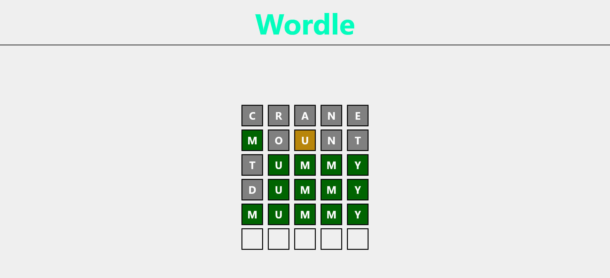
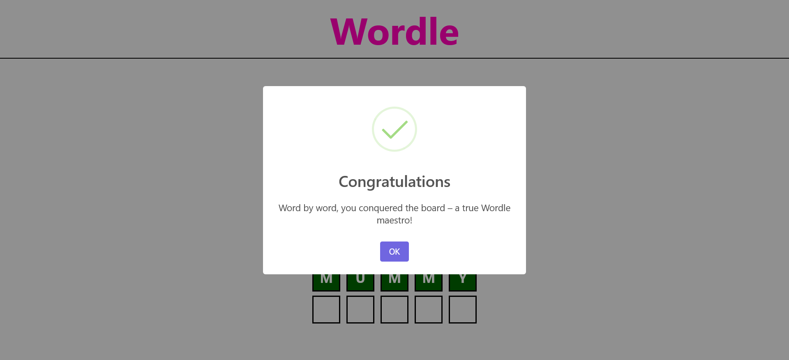
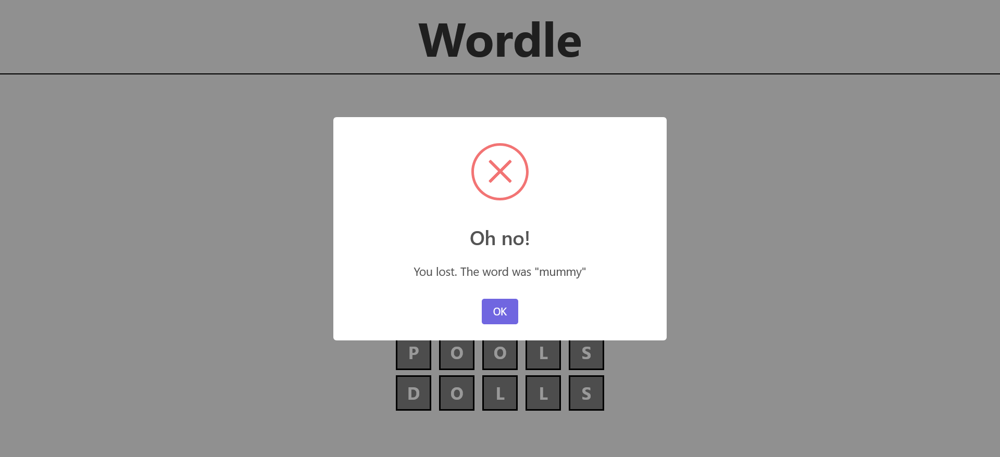

# Wordle Game

This is a Wordle clone. I did it as part of the frontend masters complete intro to web dev course.

## Table of contents

- [Overview](#overview)
    - [The challenge](#the-challenge)
    - [Screenshots](#screenshots)
- [How to play](#how-to-play)
  - [Game rules](#game-rules)
  - [Submitting your guess](#submitting-your-guess)
  - [Winning and losing](#winning-and-losing)
- [My process](#my-process)
    - [Built with](#built-with)
- [Author](#author)

## Overview

### The challenge

Users should be able to:
- Interact with the game interface on devices of various screen sizes.
- Guess a five-letter word and submit their guess.
- See the results of their guess and the game's progress.
- Encounter a "Congratulations" screen when the game is won.
- Encounter a "You lost" screen when the game is lost.
- 
### Screenshots

## How to Play

### Game Rules
You have a limited number of attempts to guess the hidden five-letter word.
Each guess should be a five-letter word containing only alphabetical characters.
After each guess, you'll receive feedback on your guess:
- Correct letters in the correct position will be highlighted. 
- Correct letters in the wrong position will be indicated. 
- Incorrect letters will be shown as such.
Use the feedback to refine your guesses and solve the word within the given attempts.

### Submitting Your Guess
Type your five-letter guess into the input field provided.
Click the "Submit" button to submit your guess.
Receive feedback on your guess and adjust your strategy accordingly.

### Winning and Losing
Congratulations Screen: When you successfully guess the correct word within the allowed attempts, you'll be greeted with a cheerful "Congratulations" screen. You cracked the code!
You Lost Screen: If you run out of attempts without guessing the correct word, you'll encounter a "You lost" screen. Don't worry, practice makes perfect!

## My process

### Built with

- Semantic HTML5 markup
- Responsive CSS
- Parcel
- JavaScript fetch API
- SweetAlert 2

## Author

- GitHub - [YounesMakhlouf](https://github.com/YounesMakhlouf)

Are you up for the challenge? Start guessing those words and have fun playing Wordle!